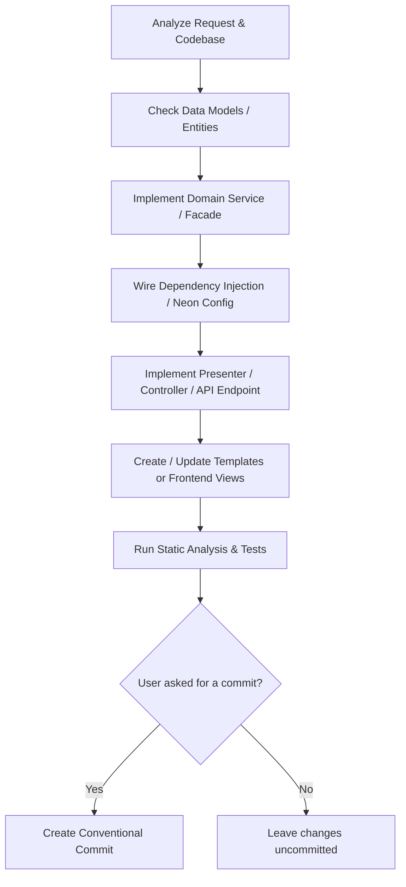

# Web Development Playbook for AI Agents

This playbook outlines standard operating procedures and workflows for autonomous or semi-autonomous AI agents working on web projects.

---

## 1. Feature Implementation Workflow

When tasked with implementing a new feature or domain logic:

### Steps:
1. **Analyze Requirements**: Locate existing modules, entities, and services that relate to the requested feature.
2. **Data Layer (if needed)**:
   - Define or update entities with proper Doctrine annotations/attributes.
   - Generate database migration (`docker compose exec app php www/index.php migrations:diff`).
   - Test migration execution and rollback.
3. **Business Logic Layer**:
   - Implement business logic within domain services or facades.
   - Use strict typing and validate edge conditions (empty lists, invalid inputs, unauthorized states).
4. **Configuration & DI**:
   - Register new services in the module's Neon/YAML config.
   - Verify that autowiring resolves all parameters cleanly.
5. **Presentation Layer**:
   - Add actions to Presenter/Controller.
   - Create or update Latte/HTML templates or API responses.
6. **Validation**:
   - Run linter: `docker compose exec app php tests/latte-linter.php app` (if Latte).
   - Run PHPStan: `docker compose exec app composer run phpstan`.
   - Run tests: `docker compose exec app composer run tester`.
7. **Commit (only if the user asked for one)**:
   - Do not commit automatically once validation passes — leave the changes uncommitted and hand control back to the user unless they explicitly requested a commit.
   - When a commit is requested, follow `commit-contribution-guidelines`.

---

## 2. Bug Fix Workflow

1. **Reproduce & Isolate**:
   - Identify the exact reproduction steps, logs, or failing test case.
   - Check error logs under `log/` or container logs.
2. **Root Cause Analysis**:
   - Trace the flow from Entrypoint -> Routing -> Presenter -> Facade -> Repository/Database.
3. **Implement Fix**:
   - Apply the minimal, cleanest fix addressing the root cause rather than symptoms.
   - Avoid side effects in shared components or facades.
4. **Write Regression Test**:
   - Add a test in `tests/asserts/` verifying the bug fix and preventing regressions.
5. **Quality Verification**:
   - Run full verification (`docker compose exec app composer run phpstan && docker compose exec app composer run tester`).
6. **Commit (only if the user asked for one)**:
   - Do not commit automatically — leave the fix uncommitted unless the user explicitly requested a commit.
   - When a commit is requested, document root cause and fix in the commit body.

---

## 3. Pre-Commit Quality Checklist

This checklist applies only when the user has actually asked for a commit — never commit on your own initiative just because a task is finished. Before creating that commit, ensure:
- [ ] Code follows project formatting standards (`.editorconfig`, `.php-cs-fixer`).
- [ ] No syntax errors or undefined variables.
- [ ] PHPStan passes at the required level with no new unbaselined errors.
- [ ] Template linter passes with zero errors.
- [ ] All unit/integration tests pass.
- [ ] Commit message conforms strictly to `commit-contribution-guidelines`.
